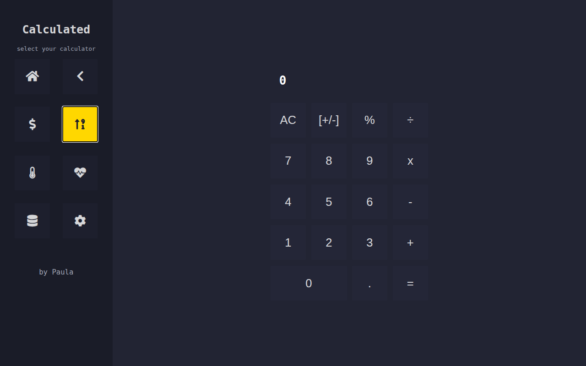

# Calculator

A simple calculator web app built with vanilla HTML, CSS, and JavaScript. It supports basic arithmetic operations and features a clean, responsive UI.



## 🔗 Live Demo

[View Calculator Live](https://calculator-ip3ula.vercel.app)

## 🛠️ Features

- Basic operations: addition, subtraction, multiplication, division
- Responsive design
- Keyboard and button support
- Clear, Delete, and Decimal handling

## 📂 Technologies Used

- HTML
- CSS
- JavaScript (Vanilla)

## 📸 Screenshot


## 🚀 Getting Started

1. Clone the repository:
   ```bash
   git clone https://github.com/ip3ula/calculator.git
